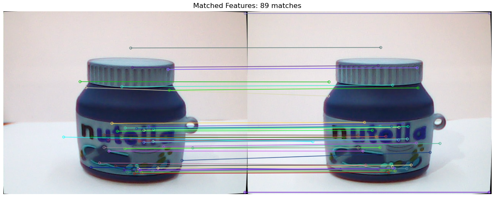
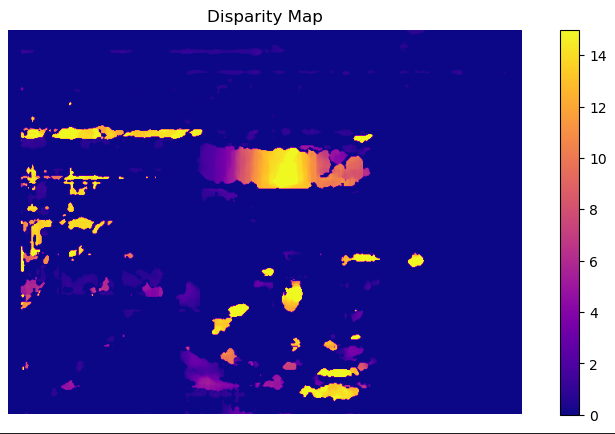
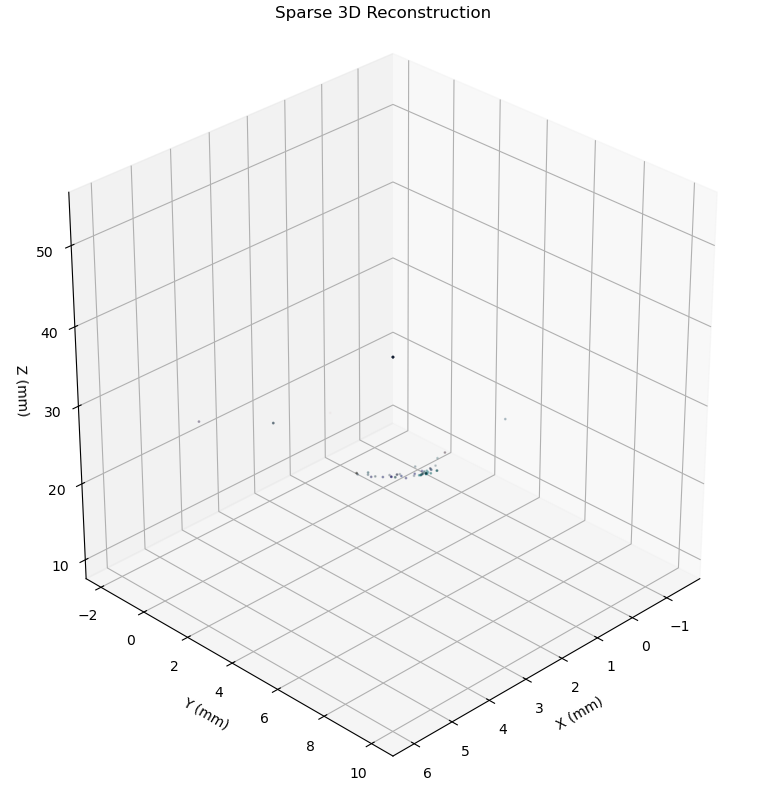
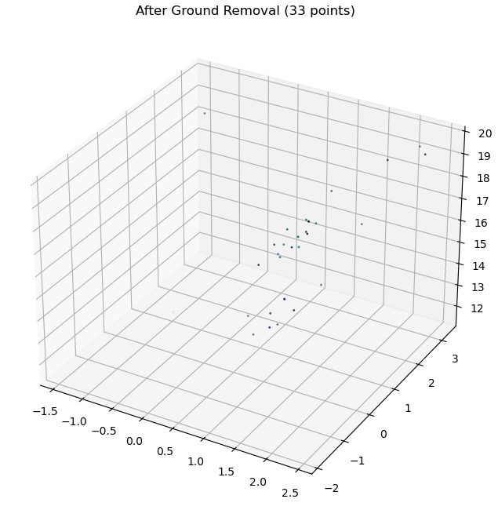
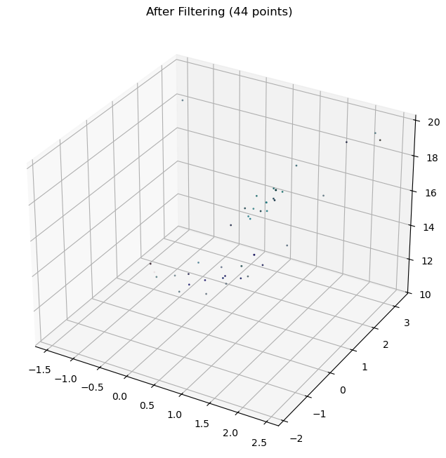

# Stereo Vision 3D Reconstruction Pipeline

A modular pipeline for stereo camera calibration, feature matching, stereo geometry estimation, rectification, 3D reconstruction, and robust point cloud filtering.

---

## 📂 Project Structure

```
├── modules/
│   ├── calibration.py                   # Camera calibration utilities
│   ├── feat_matching.py                 # Feature detection & matching
│   ├── stereo_geometry_estimation.py    # Estimate essential matrix and camera pose
│   ├── stereo_rectification.py          # Stereo rectification & disparity computation
│   ├── reconstruction.py                # Triangulation & 3D reconstruction
│   └── filtering_refining.py            # Robust point cloud filtering & post-processing
├── docs/
│   └── images/                          # Result screenshots
│       ├── match.PNG
│       ├── disparity-map.PNG
│       ├── sparse3d.PNG
│       ├── ground-removal.PNG
│       └── filtered-sparse.PNG
├── main.ipynb                           # End-to-end Jupyter notebook example
└── README.md                            # Project overview & usage
```

---

## ⚙️ Dependencies

* Python 3.7+
* OpenCV (`opencv-python`)
* NumPy
* Matplotlib
* Open3D

Install via:

```bash
pip install opencv-python numpy matplotlib open3d
```

---

## 🚀 Installation

1. Clone this repository:

   ```bash
   git clone [https://github.com/SomaiaElbaradey/Stereo-Camera-System.git](https://github.com/SomaiaElbaradey/Stereo-Camera-System.git)
   cd Stereo-Camera-System
   ```

2. Install dependencies (see above).
3. Prepare your data:
   - Calibration: place chessboard images (`cal*.jpg`) in `cal/`.
   - Stereo pairs: have left/right image files in a data folder.

---

## 🎯 Entry Points & Usage

Below are the main functions (entry points) you can call in scripts or the notebook.

**Module paths changed to `modules/`**

### 1. Camera Calibration (`modules/calibration.py`)
```python
from modules.calibration import calibrate_camera
K, dist = calibrate_camera(
    calibration_dir="cal",
    pattern_size=(9, 7),
    square_size=15.0
)
````

### 2. Feature Detection & Matching (`modules/feat_matching.py`)

```python
from modules.feat_matching import feature_detection_and_matching
matched_img, matches, kps1, kps2 = feature_detection_and_matching(
    left_img, right_img
)
```

### 3. Stereo Geometry Estimation (`modules/stereo_geometry_estimation.py`)

```python
from modules.stereo_geometry_estimation import estimate_stereo_geometry
E, R, T, pts1, pts2 = estimate_stereo_geometry(
    kps1, kps2, matches, K
)
```

### 4. Stereo Rectification & Disparity (`modules/stereo_rectification.py`)

```python
from modules.stereo_rectification import compute_disparity
disparity = compute_disparity(
    left_img, right_img, K, dist, R, T
)
```

### 5. 3D Reconstruction (`modules/reconstruction.py`)

```python
from modules.reconstruction import reconstruct_3d
pts3d, colors = reconstruct_3d(
    left_img, right_img, K, R, T, pts1, pts2
)
```

### 6. Point Cloud Filtering & Post-Processing (`modules/filtering_refining.py`)

```python
from modules.filtering_refining import ultimate_post_process
filtered_pts, filtered_colors = ultimate_post_process(
    pts3d, colors,
    remove_ground=True,
    visualize=True
)
```

---

## 📊 Results

Visual outputs generated by each stage of the pipeline:

| Stage                               | Screenshot                                          |
| ----------------------------------- | --------------------------------------------------- |
| Feature Matching                    |            |
| Disparity Map                       |      |
| Sparse 3D Point Cloud (raw)         |        |
| Ground Removal (filtered)           |    |
| Filtered Sparse Point Cloud (final) |  |

---

## 📝 Jupyter Notebook Example (`main.ipynb`)

An end-to-end workflow is provided in `main.ipynb`, covering:

1. Calibration
2. Stereo pairing
3. Feature matching
4. Geometry & rectification
5. Triangulation & 3D reconstruction
6. Robust filtering & visualization

Open it with:

```bash
jupyter notebook main.ipynb
```

---

## 🤝 Contributing

Contributions welcome! Open issues or PRs for bugs/features.

---

*Happy 3D visioning!*
